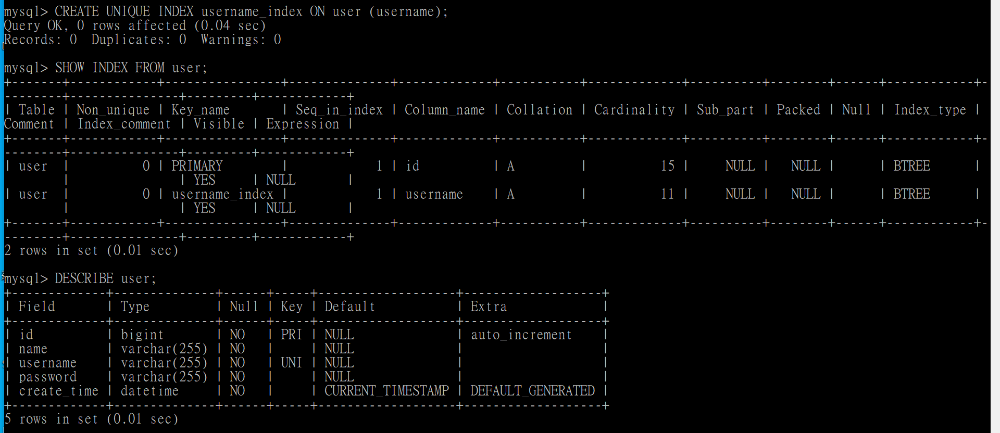
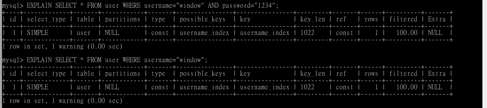

#### 考量user資料表中，username欄位在使用者註冊時會進行重複使用比較，故資料庫中username值皆不重複，故針對username欄位新增UNIQUE Index，使用語法如下
```SQL
CREATE UNIQUE INDEX username_index ON user (username);
```
##### 執行結果圖


#### 觀察查詢符合特定字串之username語法，可發現被搜尋過的列數降為1，顯示新增Index後不再搜尋整張表格

